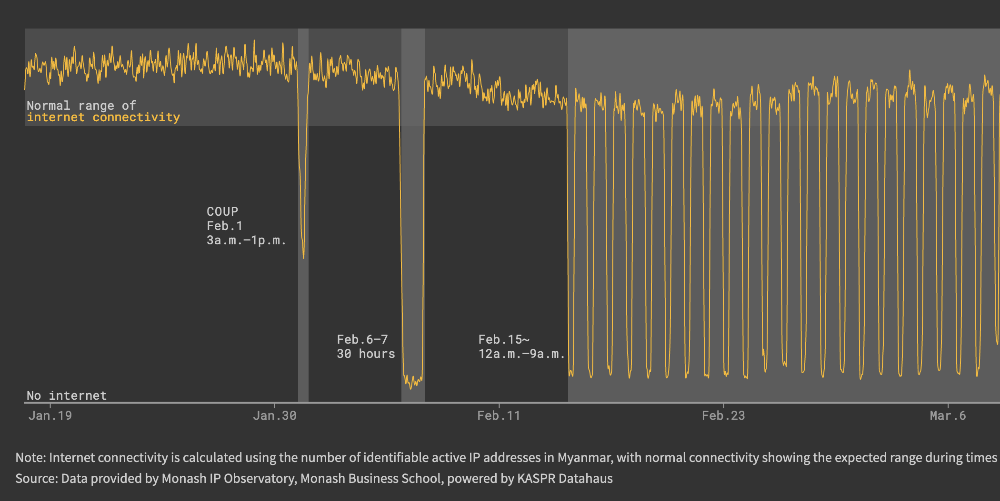

# Global Subnational Internet Quality Products

This document describes the KDH Global Subnational Internet Quality Products developed by KASPR Datahaus PTY LTD. This suit of products presents **yearly aggregates** of our few-hourly (e.g. 1h, 3h, 6h) regional (national, adm1, or adm2 accordingly)
level products provide an aggregated measure of region’s ICT Infrastructure, via millions of individual
internet protocol (IP v4) address observations. The product provides cross-secitional data on the quality (based on latency) of a region’s infrastructure aggregated across the geographic space of the region. As such,
the sampling design intentionally emphasises diversity in geographic units rather than conducting a
representative sample of all IP addresses from the region detached from geo-location (see next section).

# Global Geolocated Internet Intel & Anomaly Products

The KASPR Global Geolocated Internet Intel & Anomaly products are a suite of data on internet quality, outages and slowdowns at the hourly (1, 3, or 6) and ADM2 (e.g. county, district) level for 136 countries in the world. It contains aggregated measures of a region's ICT Infrastructure, via millions of individual internet protocol (IP) address observations measured by KASPR's proprietary monitoring technology. The raw measurement basis for this product are over 3 billion daily measurements from over 450 million internet connected end-point devices.


## Metadata {.unlisted .unnumbered}
Description | Value  
----|-----
Update Frequency | Hourly (1, 3, or 6)
Geographic Coverage | Global 
Number of Countries/States/Counties covered | 136/3,000/23,000
Time period coverage | Since FEB 2019
Historical data available | Yes, 5 years
Data Set Format | .tsv
Raw or scraped data | Raw Data (Aggregated)
Key Fields |  Country; Province/State; County/District (ADM2); Average Latency and Average Variance in Latency;  Number of days in the year with connectivity and latency anomalies; Distance to the latency frontier; 
Key Words | geospatial, internet, internet quality, latency, stability, outages


 
## Use Cases {.unlisted .unnumbered}


### Location Planning  {.unlisted .unnumbered}
Make more accurate location decisions for your critical digital infrastructure (i.e. servers, data centers). Identify districts.counties with high average internet quality, low internet volatility and few connectivity anomalies.

### Risk Analysis  {.unlisted .unnumbered}
Identify areas with high numbers of internet connectivity anomalies, low internet quality or high variability in internet latency.

### Location Data Enrichment  {.unlisted .unnumbered}
Enhance your geo-spatial risk data products by a information about local internet infrastructure quality.

### Geospatial Telecommunications Data  {.unlisted .unnumbered}
Telecommunication and ISP companies can identify new potential markets.


 ```{r echo=FALSE, message=FALSE, warning=FALSE}

```

 


## Sample Data {.unlisted .unnumbered}

Sample dataset provides immediate access to a static version of a 5% random subsample for the year 2023.

Full dataset contains information from over 26,000 ADM2 units (i.e. counties/districts)  and 136 countries.

Customized Data for individual countries or regions as well as Internet Service Provider (ISP) level  are available per request.

 

## Historical Data & Backtesting {.unlisted .unnumbered}

5 year historical data is available for purchase and backtesting. Data collection has been operating consistently and without interruptions since February 2019.

Please contact info@kasprdata.com for further information.

 


## Customization {.unlisted .unnumbered}

KASPR Datahaus PTY LTD offers additional services to interested parties where our technology can intensively measure the IP space of a subset of over one hundred metropolitan areas around the globe to provide a representative view of these specific, high IP address concentration, large urban agglomerations.

We welcome inquiries around any aspect of product design that may serve your needs. Please get in touch at info@kasprdata.com.


## Variable Defintions {.unlisted .unnumbered}

| Variable | Description |
| --- | --- |
| country_iso_three_char_code | Country's 3-digit ISO code |
| country_iso_name | Country name |
| * adm1_name | Name of the ADM1 unit. ADM1 refers to a country's first, administrative unit at the subnational level (e.g. States in the US, Bundeslaender in Germany, or Provinces in China). |
| * adm1id | Unique alpha-numerical identifier for the ADM1 unit. Combination of `country_iso_three_char_code` and an integer. |
| ** adm2_name | Name of the ADM2 unit. ADM2 refers to a country's second, administrative unit at the subnational level (e.g. Counties in the US, LGAs in Australia). |
| ** adm2id| Unique alpha-numerical identifier for the ADM2 unit. Combination of `adm1_unique_identifier` and an integer. |
| year | Year |
| rtt_variance_norm | Average Variance in Latency (ping response time in ms). Higher values indicate more volatility in internet connectivity during that period. |
| rtt_mean_norm | Average Latency (ping response time in ms). Higher values indicate lower average quality in internet connectivity during that period. |
| rtt_mean_norm_adj | Average Latency (ping response time in ms) adjusted to account for monthly infrastructure sampling baseline shifts. See main document for details. |
| connectivity_out_2sd | Number of days in *year* when connectivity (unique # of active IPs) was 2 standard deviations below the median connectivity. |
| latency_out_3sd | Number of days in *year* when *rtt_mean_norm* was 3 standard deviations above the median latency. |
| rtt_d	|Absolute difference between *rtt_mean_norm* and minimum latency in the country (rtt_min). Distance to the latency frontier.	Higher values indicate relatively lower quality.	|
|rtt_dp	|Percentage difference between *rtt_mean_norm*  and minimum latency in the country (rtt_min). Distance to the latency frontier.		Higher values indicate relatively lower quality.	 |

