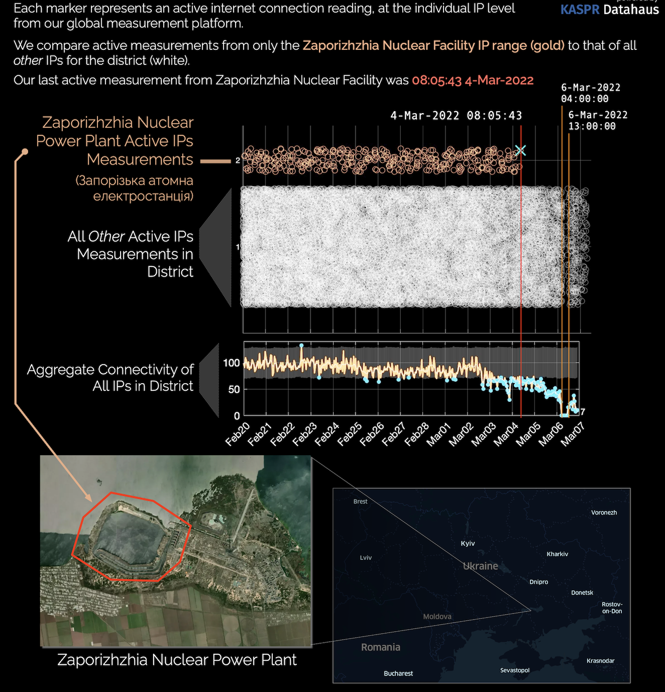
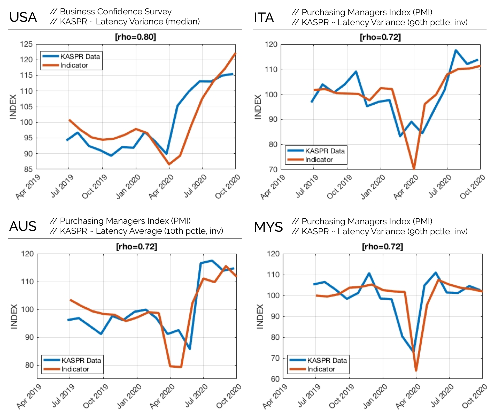
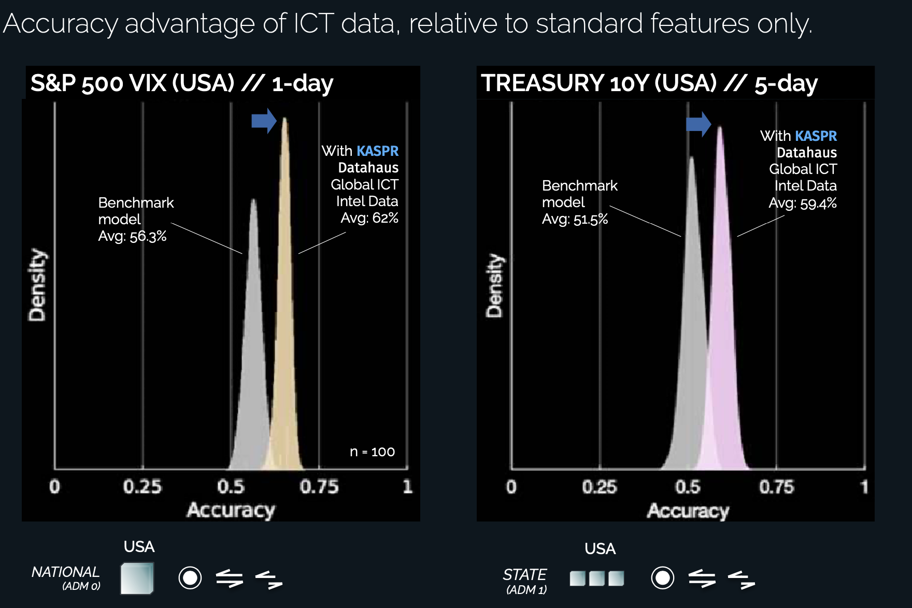
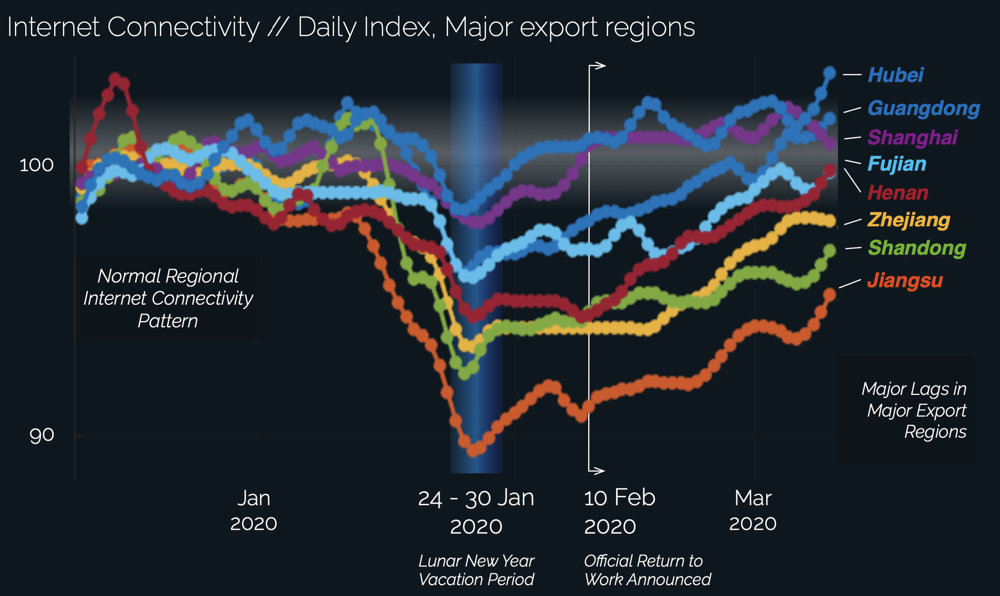
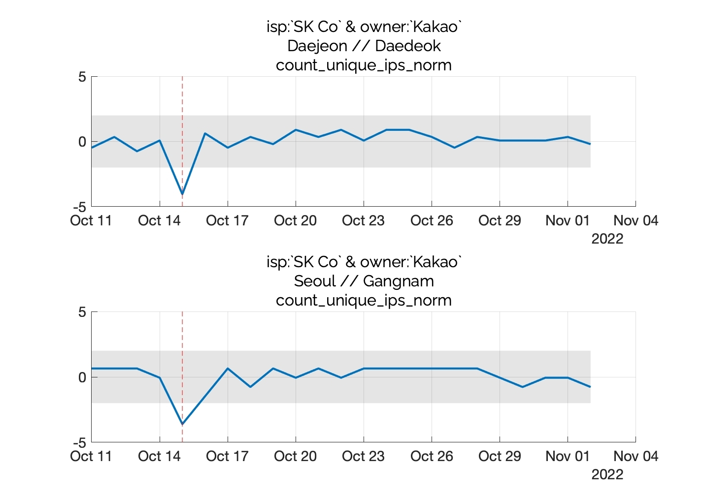

# Global Geolocated Internet Intel & Anomaly Products

The KASPR Global Geolocated Internet Intel & Anomaly products are a suite of data on internet quality, outages and slowdowns at the hourly (1, 3, or 6) and ADM2 (e.g. county, district) level for 136 countries in the world. It contains aggregated measures of a region's ICT Infrastructure, via millions of individual internet protocol (IP) address observations measured by KASPR's proprietary monitoring technology. The raw measurement basis for this product are over 3 billion daily measurements from over 450 million internet connected end-point devices.


## Metadata {.unlisted .unnumbered}
Description | Value  
----|-----
Update Frequency | Hourly (1, 3, or 6)
Geographic Coverage | Global 
Number of Countries/States/Counties covered | 136/3,000/26,000
Time period coverage | Since FEB 2019
Historical data available | Yes, 5 years
Data Set Format | .tsv
Raw or scraped data | Raw Data (Aggregated)
Key Fields |  Country; Province/State; County/District (ADM2); Average Latency and Average Variance in Latency; Timestamp (UTC & local); Connectivity and Latency Anomaly Index; Connectivity and Latency Anomaly Alert
Key Words | geospatial, internet, internet quality, latency, stability, outages


 
## Use Cases {.unlisted .unnumbered}


### Situational Awareness  {.unlisted .unnumbered}
Increase your situational awareness with near-real time updates about local internet quality and anomalies (outages, slow downs) across the world at county/district level.


 ```{r echo=FALSE, message=FALSE, warning=FALSE}

```

### Risk Analysis  {.unlisted .unnumbered}
Near real-time indicators for disruptions in the local internet infrastructure and the digital economy.


 ```{r echo=FALSE, message=FALSE, warning=FALSE}
knitr::include_graphics("images/reuters.png")
```

Read the full data story in [reuters](https://www.reuters.com/graphics/MYANMAR-POLITICS/INTERNET-RESTRICTION/rlgpdbreepo/).


### Fundamental Analysis {.unlisted .unnumbered}
Near real-time and lead indicator for economic fundamentals.

 ```{r echo=FALSE, message=FALSE, warning=FALSE}

```

### Quantitative Analysis - Algorithmic Trading {.unlisted .unnumbered}
Potential lead indicator for increased volatility on financial markets as well as disruptions in the telecommunications, cloud services, gaming, SaaS and online retail sector.


 ```{r echo=FALSE, message=FALSE, warning=FALSE}

```

### Supply Chain Risks  {.unlisted .unnumbered}
Near real-time, geo-located indicator for disruptions in counties or districts critical for companies' global supply chain.

 ```{r echo=FALSE, message=FALSE, warning=FALSE}

```


### Cyber and Parametric Insurance  {.unlisted .unnumbered}
Use unique historical, consistently measured data to calculate distribution of local outage and slow-down events, derive premiums, define event triggers and set-up trigger events in real-time.

 ```{r echo=FALSE, message=FALSE, warning=FALSE}

```


## Sample Data {.unlisted .unnumbered}

Sample dataset provides immediate access to a static version of a 5% random subsample from a sample of 12 countries, 7,682 ADM2 regions, and 230 unique time-stamps (3-hourly) during February 2024.

Countries included in this sample: Argentina, China, France, India, Indonesia, Mexico, Nigeria, Russia, South Korea, Turkey, United Kingdom, United States.


Customized data for individual countries or regions are available.

To purchase the data or options for subscriptions with continuous updates, request access through KASPR and we will reach out to discuss licensing options.


## Historical Data & Backtesting {.unlisted .unnumbered}

5 year historical data is available for purchase and backtesting. Data collection has been operating consistently and without interruptions since February 2019.

Please contact info@kasprdata.com for further information.

 


## Customization {.unlisted .unnumbered}

KASPR Datahaus PTY LTD offers additional services to interested parties where our technology can intensively measure the IP space of a subset of over one hundred metropolitan areas around the globe to provide a representative view of these specific, high IP address concentration, large urban agglomerations.

We welcome inquiries around any aspect of product design that may serve your needs. Please get in touch at info@kasprdata.com.


## Variable Definitions {.unlisted .unnumbered}

| Variable | Description |
| --- | --- |
| country_iso_three_char_code | Country's 3-digit ISO code |
| country_iso_name | Country name |
| * adm1_name | Name of the ADM1 unit. ADM1 refers to a country's first, administrative unit at the subnational level (e.g. States in the US, Bundeslaender in Germany, or Provinces in China). |
| * adm1_unique_identifier | Unique alpha-numerical identifier for the ADM1 unit. Combination of `country_iso_three_char_code` and an integer. |
| ** adm2_name | Name of the ADM2 unit. ADM2 refers to a country's second, administrative unit at the subnational level (e.g. Counties in the US, LGAs in Australia). |
| ** adm2_unique_identifier | Unique alpha-numerical identifier for the ADM2 unit. Combination of `adm1_unique_identifier` and an integer. |
| time_e | Unix timestamp |
| time_e_utc_str | Timestamp (GMT, string) |
| timezone_offset | Offset from GMT (hours) |
| timezone_name | IANA timezone name |
| time_local | Local timestamp (timezone offset applied) |
| rtt_variance_norm | Average Variance in Latency (ping response time in ms). Higher values indicate more volatility in internet connectivity during that period. |
| rtt_mean_norm | Average Latency (ping response time in ms). Higher values indicate lower average quality in internet connectivity during that period. |
| rtt_mean_norm_adj | Average Latency (ping response time in ms) adjusted to account for monthly infrastructure sampling baseline shifts. See main document for details. |
| [connectivity,latency]_indx | Unique IP counts, or mean latency, over the time period, normalised to take the value of 100 for the average of true observations considered `normal' within a long time period. See main document for details. |
| [connectivity,latency]_indx_hat | Expected unique IP counts, or expected mean latency, over the time period, normalised, based on fitted fixed-effects model for this region. See main document for details. |
| [connectivity,latency]_indx_flagL | Lower boundary of normalcy based on fitted fixed-effects model for this region ($\alpha = 0.001$). See main document for details. |
| [connectivity,latency]_indx_flagH | Upper boundary of normalcy based on fitted fixed-effects model for this region ($\alpha = 0.001$). See main document for details. |
| [connectivity,latency]_is_flag | Takes the value of 1 if the observation lies beyond the normalcy region for this measure, or 0 otherwise ($\alpha = 0.001$). |

