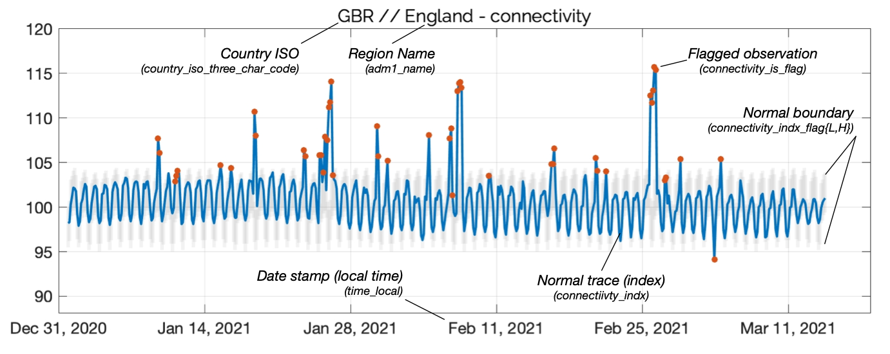

# Global Internet Anomaly Products

This document describes the KDH Global ICT Intel & Anomaly Data developed by KASPR Datahaus PTY LTD. Our few-hourly (e.g., 1h, 3h, 6h) regional (national, adm1, or adm2 accordingly) level products provide an aggregated measure of the region's ICT Infrastructure via millions of individual internet protocol (IP) address observations. The product offers the time-varying availability and quality of a region's infrastructure aggregated across the geographic space of the region. As such, the sampling design intentionally emphasizes diversity in geographic units rather than conducting a representative sample of all IP addresses from the region detached from geo-location (see next section).

## Sampling Design {.unlisted .unnumbered}

To provide a product of global scale and frequency, a random sampling methodology is necessary within some geographic boundaries due to a very high concentration of IP addresses allocated there, e.g., districts of major cities. In these often small suburban geographic boundaries, a randomized sample of 100,000 IPs is drawn to measure a diversity of unique physical locations within the boundary. Where the internet address concentration is lower, we conduct a census measurement design, i.e., measuring the activity and quality of every address in that geographic region.

To emphasize, the priority of the few-hourly Global ICT Intel product is to provide a consistent, scientific sampling methodology across tens of thousands of small geographic boundaries worldwide, such that at the regional level aggregate, significant shocks and time-varying activity patterns across the entire geographic domain of the region are incorporated.

## Global ICT Intel Data - Descriptor {.unlisted .unnumbered}

The two Global ICT Intel measures are defined as follows:

- **number_unique_active_ips_in_sample**: The sum of all unique active IP addresses in the region based on our sampling and census methodology (described above), where active means that the IP was online at least once in the sampling period. The measure only covers IP addresses in the IPv4 (IP version 4) space. This measure also serves as the unique IP sample size for the rtt measures, described below.

- **rtt_X_norm**: These are proxy measures for the temporal quality of the ICT infrastructure in a region. They are based on the ping response time (in ms) which measures the round-trip time ('rtt') for a small data package sent from our scanning platforms to each individual IP address. To account for IP-specific noise, in a first step, the average rtt (rtt') over all rtt measurements of a single IP is calculated. Then, in a second step, the average and variance of these normalized rtt values are used to form the two quality measures. In this way, focus is given to the typical IP latency of the parcel of IPs in the geographic region, and the between IP variance arising from differences in the quality of ICT infrastructure across IPs, rather than idiosyncratic properties of a particular IP in either measure.
        - rtt_mean_norm is the average ping response time of all online IP addresses sampled in a region over the period. (i.e., mean(rtt'))
        - rtt_var_norm is the variance of ping response times of all online IP addresses in a region over the period. (i.e., var(rtt'))

The variable day_indicator indicates when our scanning and aggregation technology crosses over from one scanning phase to the next (approximately around the 8-10th of a new month). It takes the value of 1 for most days and the value of 2 if it is a cross-over day. The impact is normally negligible during the cross-over days. The main variable impacted would be number_unique_active_ips_in_sample. In our own back-testing, no model selected this feature as important, confirming that the cross-over is not informationally relevant.

## Pre-adjusted IP activity counts {.unlisted .unnumbered}

For ease of use, we also provide the variables number_unique_active_ips_in_sample_adj and rtt_mean_norm_adj. These variables are equivalent to number_unique_active_ips_in_sample and rtt_mean_norm respectively, however, the impact of any sampling differences across the monthly scanning infrastructure boundary are already accounted for. For example, if a subsequent month has a higher baseline active count in a geographic parcel than a former month, the subsequent month's active IP readings are systematically shifted lower to smoothly match the end-point of the former month's readings. Note: these variable is constructed, not measured. (see Index variables below)

## Timing Definitions {.unlisted .unnumbered}

Values of Unix timestamp time_e and corresponding time string time_e_utc_str indicate the start of the period for which the measurements pertain. For example, a timestamp corresponding to 12:00:00.000 indicates measurements taken between 12:00:00.000 and 14:59:59.999.

For ease of use, we also provide three additional variables, timezone_offset, timezone_name, and time_local which provide the region's offset (from UTC in hours), IANA timezone name, and the adjusted time equivalent to the UTC time with local offset applied.

Note: if the larger region (e.g., national) has more than one timezone within it (e.g., at adm1 level), the most frequent timezone across the lower geographic zones is applied to the larger region.

## Index Values & Anomaly Detection Flags {.unlisted .unnumbered}

For ease of use, we also provide a pre-prepared set of index and anomaly features. Indices for connectivity and latency are prepared in a similar manner, based on their respective underlying variables, number_unique_active_ips_in_sample_adj and rtt_mean_norm_adj.

First, an unsupervised clustering algorithm is run over a trailing series of observations for a given region (e.g., 90 days). The algorithm is exposed to a number of data features that enable grouping of most likely 'normal' and 'suspect' readings. Next, by assuming anomalies are relatively rare, large clusters are grouped to build a sufficiently large learning set of observations from which to derive statistical features.

Next, an index is constructed for the relevant connectivity or latency variable by normalizing the average value from the learning set to an arbitrary value of 100, producing connectivity_index and latency_index. Then, a fixed-effects model is built around the learning set, based on time-of-day and day-of-week features, to construct an expected value of the index through time, e.g., connectivity_index_hat. Finally, the model is used to produce 99.9% prediction intervals ($\alpha = 0.001$) which provide lower and upper normalcy boundaries for the data, e.g., connectivity_indx_flagL, connectivity_indx_flagH.

Finally, each observation is checked for its anomaly state, being flagged if it is found to lie outside the statistically derived normalcy boundaries, e.g., connectivity_is_flag.

We note that anomaly boundaries and associated flags are provided for ease of application, though construction of alternative thresholds, anomaly detection methodologies, and models is encouraged for specific use-cases.

## Anomaly Detection Module Inclusion Criteria {.unlisted .unnumbered}

To support statistical inference behind the anomaly detector module, two inclusion criteria are applied. For regions which do not fulfill one or both of these policies, counts of unique IPs and latency information only is provided, with NaNs in place of anomaly columns.

- **Min Observation Policy:** Regions must have at least one temporal period (e.g., 3h), within the dataset window, with at least 100 unique active IP observations.
- **Min Non-Zero Days Policy:** Regions must have at least 14 days' (of the dataset window) of non-zero readings.

## Suggested Use {.unlisted .unnumbered}

-  Due to differences in the setup of the physical backbone of each region's ICT infrastructure, comparing the raw levels of our measures between regions (between variation) is not advised.
-  The value of the Global ICT & Anomaly Intel product comes from the hourly and daily, time-varying signal at the given regional-level (within variation). As such, it is ideally suited to be combined with other time-series (e.g., few-hourly, daily, weekly, monthly) data from the respective region.
-   If a comparison of changes in ICT infrastructure between geographic regions is desired, a good approach would be to simply build the first differences of our measures at the regional level and compare, or, to use the pre-prepared index values as given.
-  Given the high-frequency of the Global ICT & Anomaly Intel product, it is well suited to detect shocks to a region's ICT infrastructure. These shocks can include electricity outages, political events, violent conflict, natural disasters, or sovereign suppression activities.

## Example {.unlisted .unnumbered}

Below we provide a labelled example from the data set, here, the ADM1 region 'England', from the country 'GBR' (Great Britain).

 ```{r echo=FALSE, message=FALSE, warning=FALSE}

```

## Historical Data & Backtesting {.unlisted .unnumbered}

5 year historical data is available for purchase and backtesting. Data collection has been operating consistently and without interruptions since February 2019.

Please contact info@kasprdata.com for further information.

## Disclaimer {.unlisted .unnumbered}

KDH Global ICT Intel Data is constructed from remote measurements based on the Internet Control Message Protocol (ICMP) echo request routine. As any remote measurement technology, KDH Global ICT Intel Data can only be an approximation of the local internet infrastructure and human experience of the internet on the ground. It is important to note that:

1. Our measurements only cover IP addresses in the IPv4 (IP version 4) space.
2. Any IP addresses that are not reachable by ICMP echo requests are not included in our measurements.
3. The geolocation information for each of the individual IP addresses is based on data from Third Party providers and are updated on a monthly basis. The level of accuracy of the IP geolocation can vary across geographies and time and this can affect the accuracy of the KDH Global ICT Intel Data products. KASPR Datahaus PTY LTD makes no additional or express or implied warranties related to the accuracy of this location data across space and time.

## Assumptions {.unlisted .unnumbered}

Furthermore, KDH data acquisition and data service provision relies on an assumed wider operating environment beyond the control or authority of KDH. Failure or interruption in any aspect of this operating environment can render KDH unable to acquire or provide data to clients in a timely manner, or at all. Assumed features of the operating environment include, but are not limited to:

1. A functioning global internet layer, allowing the free flow of information packets, especially ICMP echo requests, across all networks and jurisdictions.
2. Network neutrality such that KDH packets are managed in the internet layer in an equally expeditious manner to any other packet on the network.
3. A fully functional and operational commercial cloud infrastructure network, allowing remote server operation, interaction, data transmission between remote servers and storage locations, query at rest functions, and programmatic interaction and job activation.
4. A functioning remote authentication service and delivery mechanism to the client for final data transfer.

AS SUCH, KDH GLOBAL ICT INTEL DATA IS PROVIDED “AS IS” AND KASPR DATAHAUS PTY LTD MAKES NO ADDITIONAL OR EXPRESS OR IMPLIED WARRANTIES RELATING TO THE KASPR DATAHAUS DATA INCLUDING BY WAY OF EXAMPLE WARRANTIES OF MERCHANTABILITY OR FITNESS FOR A PARTICULAR PURPOSE.
Background Intellectual Property

In preparing these products KASPR Datahaus Pty Ltd asserts the ownership of the following methods and knowledge as background intellectual property in the field of measuring internet activity, latency and detection of anomalies, globally:

- A method to scan, aggregate, analyse and visualise the number of latency (measured by ping response time) of very large numbers of internet-connected Internet Protocol addresses at a given location and time to produce internet measurement data.
- Methods to carry out these functions from an online desktop device, remote server, or team of servers located in commercial cloud-based hosting platforms.
- Methods to join internet measurement data with geo-location data for the purposes of re-aggregation, re-analysis, and visualization.
- A sampling method that aims at reducing the number of scanned IPs that are required to infer reliable measurements.
- Methods to detect statistical anomalies and irregularities in internet measurement data, with tunable thresholds.
- Methods to remotely deliver internet measurement data and derivative datasets to client end-points.

## Customization {.unlisted .unnumbered}

KASPR Datahaus PTY LTD offers additional services to interested parties where our technology can intensively measure the IP space of a subset of over one hundred metropolitan areas around the globe to provide a representative view of these specific, high IP address concentration, large urban agglomerations.

We welcome inquiries around any aspect of product design that may serve your needs. Please get in touch at info@kasprdata.com.


## Variable Definitions {.unlisted .unnumbered}

| Variable | Description |
| --- | --- |
| country_iso_three_char_code | Country's 3-digit ISO code |
| country_iso_name | Country name |
| * adm1_name | Name of the ADM1 unit. ADM1 refers to a country's first, administrative unit at the subnational level (e.g. States in the US, Bundeslaender in Germany, or Provinces in China). |
| * adm1_unique_identifier | Unique alpha-numerical identifier for the ADM1 unit. Combination of `country_iso_three_char_code` and an integer. |
| ** adm2_name | Name of the ADM2 unit. ADM2 refers to a country's second, administrative unit at the subnational level (e.g. Counties in the US, LGAs in Australia). |
| ** adm2_unique_identifier | Unique alpha-numerical identifier for the ADM2 unit. Combination of `adm1_unique_identifier` and an integer. |
| time_e | Unix timestamp |
| time_e_utc_str | Timestamp (GMT, string) |
| timezone_offset | Offset from GMT (hours) |
| timezone_name | IANA timezone name |
| time_local | Local timestamp (timezone offset applied) |
| rtt_variance_norm | Average Variance in Latency (ping response time in ms). Higher values indicate more volatility in internet connectivity during that period. |
| rtt_mean_norm | Average Latency (ping response time in ms). Higher values indicate lower average quality in internet connectivity during that period. |
| rtt_mean_norm_adj | Average Latency (ping response time in ms) adjusted to account for monthly infrastructure sampling baseline shifts. See main document for details. |
| [connectivity,latency]_indx | Unique IP counts, or mean latency, over the time period, normalised to take the value of 100 for the average of true observations considered `normal' within a long time period. See main document for details. |
| [connectivity,latency]_indx_hat | Expected unique IP counts, or expected mean latency, over the time period, normalised, based on fitted fixed-effects model for this region. See main document for details. |
| [connectivity,latency]_indx_flagL | Lower boundary of normalcy based on fitted fixed-effects model for this region ($\alpha = 0.001$). See main document for details. |
| [connectivity,latency]_indx_flagH | Upper boundary of normalcy based on fitted fixed-effects model for this region ($\alpha = 0.001$). See main document for details. |
| [connectivity,latency]_is_flag | Takes the value of 1 if the observation lies beyond the normalcy region for this measure, or 0 otherwise ($\alpha = 0.001$). |

